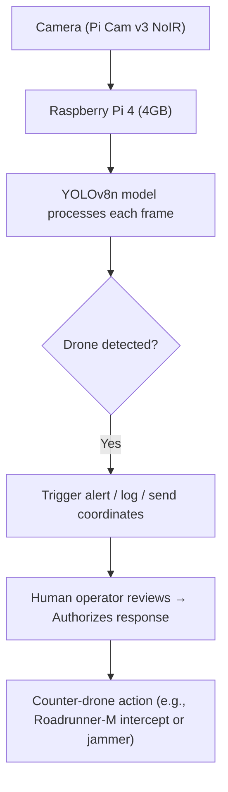

# HawkEye: A Drone Detection System

An edge-AI drone detection system optimized for the Raspberry Pi 4. This project uses a custom-trained YOLOv11x model to detect hostile drones in real-time while ignoring common false positives like birds, airplanes, and helicopters.

## Features
- **Edge-Optimized Inference:** Uses `rpicam-vid` to pipe an MJPEG stream directly into Python, achieving stable 5-15 FPS on a Raspberry Pi 4 CPU using NCNN or TFLite.
- **Robust 6-Class Model:** Trained on over 12,000 images to distinguish between drones, birds, airplanes, helicopters, balloons, and kites.
- **Auto-Annotation Pipeline:** Includes computer vision scripts (HSV color masking) to automatically generate YOLO bounding box labels for custom 3D-printed targets, bypassing manual annotation.
- **Web Dashboard:** A futuristic HTML/JS Ground Control Station (GCS) UI with flight modes, an artificial horizon, and telemetry visualization.

## Directory Structure
```text
HawkEye/
├── front/                  # Ground Control Station dashboard (controller.html)
├── notebooks/              # Google Colab notebooks for model training and multi-class dataset merging
└── src/
    ├── data/               # Scripts to capture webcam datasets and auto-label images
    ├── deployment/         # Edge inference script for the Raspberry Pi (pi_inference.py)
    └── training/           # Local fine-tuning script for the YOLOv11x model
```

---

# User Guide: Running the System

This guide will walk you through deploying the Drone Detection System, from gathering your own custom data to running live inference on a Raspberry Pi.

## 🛠 Prerequisites

### Hardware Needed:
- **Raspberry Pi 4** (4GB or 8GB recommended)
- **Raspberry Pi Camera Module** (Module 3 NoIR recommended for day/night vision)
- Optional: A PC/Laptop with a webcam (for data collection)
- Optional: An IR LED floodlight (for night detection)

### Software Needed:
Ensure Python 3 is installed on your PC and your Raspberry Pi. Then, install the required packages:
```bash
pip install ultralytics opencv-python numpy
```

## Step 1: Capture Your Custom Drone (Optional)
*If you already have a trained model (`best.pt`), you can skip to Step 3.*

If you want the system to recognize a specific custom drone (e.g., a 3D-printed model), you can quickly generate a dataset using your PC's webcam.

1. **Capture Images:** Run the capture script.
   ```bash
   python src/data/capture_dataset.py
   ```
   - Press **1** to enter Drone Mode. Hold your drone in front of the camera and rotate it. It will capture an image every second.
   - Press **2** to enter Background Mode. Remove the drone from the frame and capture empty room backgrounds.
2. **Auto-Label:** Don't waste time drawing boxes manually. Run the auto-labeler to automatically detect your drone using color/shape masking and generate YOLO labels.
   ```bash
   python src/data/auto_labeler.py
   ```
   Your perfectly annotated dataset will be saved in `Annotated_Test/` and `My_Custom_Labels/`.

## Step 2: Train the Model

You have two options for training your YOLO object detection model:

### Option A: Local Training (Requires a GPU)
If you have a powerful PC, you can train locally using the `train_finetune.py` script. 
1. Place your dataset into a `dataset/` folder at the root of the project.
2. Run the training script:
   ```bash
   python src/training/train_finetune.py
   ```
   Once finished, look for the resulting weights file located at `runs/train/drone_custom/weights/best.pt`.

### Option B: Cloud Training (Recommended for accuracy)
For the most robust system, we recommend using Google Colab (T4 GPUs are available for free).
1. Open Google Colab and upload the notebook located at `notebooks/colab_train.ipynb`.
2. This notebook automatically downloads over 12,000 images of drones, birds, airplanes, helicopters, and balloons.
3. Run all cells. It will train a 6-class model that drastically reduces false alarms.
4. Download the output file (`sky_best.zip`) which contains your `best.pt` file.

## Step 3: Deploy on PC / Laptop (Webcam)

Now we will run the live detection script natively on your computer using your built-in webcam.

1. **Place Weights:** Ensure your newly trained `best.pt` file is in the root directory of the project. (If not found, it will automatically download a base YOLOv8n model).
2. **Run Inference:**
   ```bash
   python src/deployment/pc_inference.py
   ```
   
> [!NOTE]
> **How it works:** The script will automatically detect if you have a GPU (CUDA) or Apple Silicon (MPS) to accelerate inference. It opens your webcam, feeds the frames to the YOLO model, and pops up a live window displaying the video feed with bounding boxes drawn over detected drones. Press **'q'** to quit the window.

### Alternative: Deploy on Edge (Raspberry Pi)

If you still want to deploy HawkEye to a headless Raspberry Pi:

1. **Transfer Files:** Copy this entire project folder to your Raspberry Pi.
2. **Run Inference:**
   ```bash
   python src/deployment/pi_inference.py
   ```
   
> [!NOTE]
> **How it works:** The Pi script triggers the hardware-accelerated `rpicam-vid` command to stream camera footage directly into Python memory instead of using standard OpenCV captures, which drastically improves FPS on the Pi.

If a drone is detected, you will see output like this in your terminal:
```
DRONE DETECTED | conf=0.89 | bbox=[120,45,200,180]
```

## Step 4: The Web Dashboard (Ground Control Station)

To view the futuristic Ground Control UI:
1. Open the file `front/controller.html` in any modern web browser (Chrome, Firefox, Safari).
2. The UI features an artificial horizon, compass, telemetry dials, and simulated flight mode controls.

> [!TIP]
> **Connecting the Pi to the UI:** To make the UI live, you would set up a WebSocket server on the Raspberry Pi that streams telemetry data (Altitude, Yaw, Pitch) to the Web UI. Enter the Pi's IP address into the UI and click "Connect".

---

# Architecture & Research Report

**Prepared by:** BLShaw  
**Purpose:** Military Defense Project - Drone Detection using Raspberry Pi 4  
**Date:** June 2026

## 1. What We're Building

A ground-based drone detection system that uses a camera and AI to spot hostile drones in real-time, tell them apart from birds and planes, and trigger a response - all running on a **Raspberry Pi 4 (4GB, v1.2)**.

The goal: **90%+ detection accuracy** with stable FPS (frames per second).

## 2. How Real Military Systems Do It (Reference Systems)

### AeroEye (by Drone Defence UK)
- Uses HD cameras + AI to detect drones **over 1 km away**
- Tracks multiple drones at once, full 360° coverage
- Automatically zooms in and follows the drone's path

### Anduril Roadrunner-M (USA)
- A small jet-powered drone that **hunts and destroys other drones**
- Launches in seconds from a box called the "Nest"
- Flies at high speed, locks onto the target, destroys it with a warhead
- If it turns out to be a false alarm - it flies back and lands safely
- Cost: ~$500,000 per unit

### Anduril Lattice AI (The Brain)
- Software that connects all sensors (cameras, radar, satellites) into one screen
- AI automatically detects, classifies, and tracks threats
- One operator can manage the whole system from a laptop

**Key takeaway for our project:** Real systems use multiple sensors together. Our Raspberry Pi version focuses on the **camera + AI** layer of this.

## 3. The Camera - Raspberry Pi Camera Module 3 NoIR

| Feature | Spec |
|---|---|
| Sensor | Sony IMX708, 12MP |
| Resolution | Up to 4608×2592 |
| Video | 1080p @ 50 FPS, 720p @ 100 FPS |
| Field of View | 75° (standard) or 120° (wide) |
| Night Vision | Yes (NoIR = no IR filter, works with IR LEDs) |
| HDR | Yes |
| Price | ~$25 |

**Detection Range:** Realistically detects a drone clearly up to **100–150 metres** with standard lens. For longer range, add a USB telephoto camera.

For night use: pair the NoIR camera with **850nm IR LED floodlights** - invisible to humans, visible to the camera.

## 4. The AI Model - YOLOv8 (You Only Look Once)

**Why YOLO?** It's fast, accurate, and runs on small hardware like the Raspberry Pi.

**Which version for RPi 4?** → **YOLOv8n (nano)** - smallest and fastest version, optimized for limited hardware.

**What it does:** Looks at each camera frame, draws a box around the drone, and says "drone detected - 94% confidence."

**Performance target:**
- mAP50 (accuracy score): **above 0.90** (90%+)
- FPS on RPi 4: **5–15 FPS** (stable, usable for real-time detection)
- To boost FPS: convert model to **INT8 format** using TFLite or ONNX

## 5. The Dataset - What to Train On

We need images of drones AND non-drones so the model learns the difference.

### Classes to include:
| Class | Why |
|---|---|
| Drone / UAV | Main target to detect |
| Bird | Looks similar on camera, must not trigger false alarm |
| Airplane | Different flight pattern, must be ignored |
| Helicopter | Rotating blades - similar to drone but bigger |
| Balloon | Slow-moving, non-threat |

### Where to get the data (free):
- **Roboflow Universe** → search "drone detection" → 2,600–22,000+ labelled images available
- **AOD-4 Dataset** → 22,516 images, 4 classes: drones, birds, helicopters, airplanes
- **Anti-UAV Dataset** → military-focused, infrared + visible light footage

### Data augmentation (making dataset bigger/stronger):
Flip, rotate, blur, crop, and change brightness on existing images → this multiplies your dataset size and makes the model more robust.

## 6. Training the Model

| Step | What to Do |
|---|---|
| 1. Collect dataset | Download from Roboflow (5,000–10,000 images minimum) |
| 2. Annotate | Label boxes around drones in every image (Roboflow auto-annotates) |
| 3. Train | Use **Google Colab** (free GPU) - train for **150 epochs** |
| 4. Export | Export to **TFLite or ONNX** format for Raspberry Pi |
| 5. Deploy | Copy model to RPi, run with Python + OpenCV |

**Target accuracy:** mAP50 > 0.90 achieved consistently with 150 epochs + augmentation.

## 7. How False Detections Are Avoided

The biggest challenge: **drones and birds look almost identical on radar and camera.**

| Object | How We Tell It Apart From a Drone |
|---|---|
| Bird | Irregular flapping movement, no rigid frame shape, different flight pattern |
| Airplane | Much faster, fixed wings, flies in straight lines at high altitude |
| Balloon | Drifts with wind, no motor, no directional flight |
| Helicopter | Larger, slower rotation, very different size profile |

**Techniques used:**
- Multi-class training (model sees all these objects during training)
- Confidence threshold set to **>0.75** (ignores weak detections)
- Behavioral tracking: if object moves like a drone (directional, fast, hovering) → alert

## 8. Full System Flow (How It All Connects)



## 9. Budget (Basic Setup)

| Item | Estimated Cost |
|---|---|
| Raspberry Pi 4 (4GB) | ~$55 |
| Camera Module 3 NoIR | ~$25 |
| IR LED floodlight (850nm) | ~$15 |
| MicroSD card (64GB) | ~$10 |
| Power supply + case | ~$15 |
| Google Coral USB TPU (optional, boosts FPS) | ~$60 |
| **Total** | **~$120–$180** |

## 10. Key Takeaways

- Real military systems (AeroEye, Anduril) use **multiple sensors** - radar, RF, cameras, acoustics - fused together. Our system covers the **visual/AI layer**.
- **YOLOv8n** is the right model for Raspberry Pi 4 - fast, accurate, lightweight.
- Train on **5,000–10,000 images** with drone, bird, airplane, balloon, helicopter classes.
- **150 epochs + data augmentation** consistently hits 90%+ accuracy.
- The **Camera Module 3 NoIR** covers day and night detection up to ~150m.
- Export to **TFLite INT8** to keep FPS stable on the Pi.
- Always run a **confidence threshold of 0.75+** to kill false positives.

---

